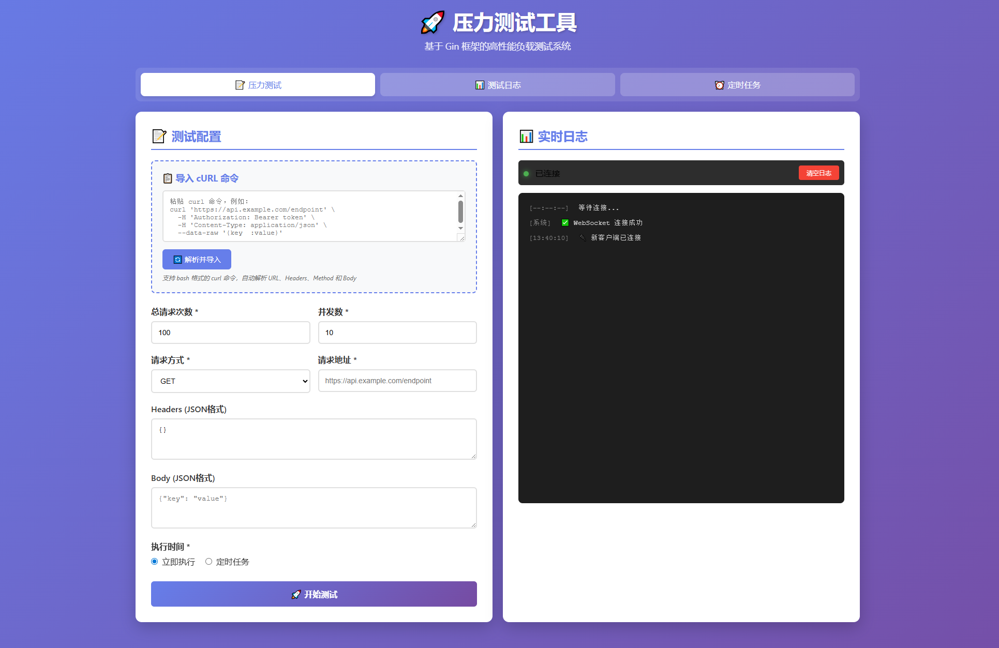

# 🧰 LoadTest - 压力测试工具

[](https://golang.org)
[](LICENSE)
[](https://github.com/guyi57/loadtest)

基于 Gin 框架的现代化压力测试工具，支持并发请求、定时任务、测试日志和实时 WebSocket 显示。

## ✨ 功能特性

- ✅ 支持 GET/POST 请求
- ✅ 自定义并发数和请求次数
- ✅ 自定义 Headers 和 Body
- ✅ 立即执行或定时任务（Cron 表达式）
- ✅ 实时日志显示（WebSocket）
- ✅ 压测结果统计
- ✅ **定时任务管理**（查看、取消）
- ✅ **SQLite 数据库持久化**（服务器重启后任务不丢失）
- ✅ **测试日志记录**（所有测试结果自动保存）
- ✅ **cURL 命令导入**（一键解析 curl 命令）
- ✅ **HTML 资源嵌入**（单文件部署，无需 templates 目录）
- ✅ **自动端口切换**（端口被占用时自动切换）
- ✅ **自动打开浏览器**（启动后自动打开页面）

## 安装依赖

```bash
go mod tidy
```

这将自动下载所有依赖，包括：
- Gin Web 框架
- GORM ORM 框架
- SQLite 数据库驱动
- WebSocket 支持
- Cron 定时任务

## 🚀 运行

**方式一：直接运行（推荐）**
```bash
go run .
```

**方式二：使用脚本**
```bash
run.bat
```

**方式三：编译后运行**
```bash
go build -o loadtest.exe
.\loadtest.exe
```

⚠️ **注意**：必须使用 `go run .` 而不是 `go run main.go`，因为代码已拆分到多个文件。

启动后会：
- 自动查找可用端口（默认 8080，被占用则自动切换）
- 自动打开浏览器
- 自动创建数据库文件 `loadtest.db`

## 项目结构

```
ginv2/
├── main.go          # 主入口（启动服务器）
├── models.go        # 数据模型定义
├── database.go      # 数据库初始化
├── handlers.go      # HTTP 请求处理器
├── loadtest.go      # 压力测试核心逻辑
├── tasks.go         # 定时任务管理
├── websocket.go     # WebSocket 实时日志
├── utils.go         # 工具函数（端口检测、打开浏览器）
├── templates/       # HTML 模板（会被嵌入到可执行文件）
│   └── index.html
├── loadtest.db      # SQLite 数据库（自动创建）
├── run.bat          # 启动脚本
└── README.md
```

## 数据持久化

**定时任务**和**测试日志**都保存在 SQLite 数据库中：
- 数据库文件：`loadtest.db`
- 自动恢复：服务器重启后自动恢复所有任务
- 历史记录：所有测试结果永久保存
- 便于部署：只需一个 `.exe` 文件（HTML 已嵌入）

## 部署

编译后只需要一个文件：
```bash
go build -o loadtest.exe
```

部署时只需：
- ✅ `loadtest.exe`（HTML 模板已嵌入）
- ✅ `loadtest.db`（可选，首次运行自动创建）

无需 `templates` 目录！

## ⏰ Cron 表达式格式

```
* * * * *
│ │ │ │ │
│ │ │ │ └─── 星期几 (0 - 6) (0 是周日)
│ │ │ └───── 月份 (1 - 12)
│ │ └─────── 日期 (1 - 31)
│ └───────── 小时 (0 - 23)
└─────────── 分钟 (0 - 59)
```

示例:
- `* * * * *` - 每分钟执行
- `*/5 * * * *` - 每5分钟执行
- `0 * * * *` - 每小时执行
- `0 0 * * *` - 每天0点执行

## 📸 截图



## 🤝 贡献

欢迎提交 Issue 和 Pull Request！

## 📄 许可证

本项目采用 MIT 许可证 - 详见 [LICENSE](LICENSE) 文件

## 👨‍💻 作者

- GitHub: [@guyi57](https://github.com/guyi57)

## ⭐ Star History

如果这个项目对你有帮助，请给个 Star ⭐️

---

**Built with ❤️ using Go and Gin Framework**
